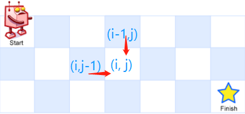

#### [62. Unique Paths](https://leetcode-cn.com/problems/unique-paths/)

一个 m × n 二维矩阵，从左上角移动到右下角总共有几种可能？规定每次只能向右或向下移动一格。


```
输入: m = 3, n = 2
输出: 3
解释:
从左上角开始，总共有 3 条路径可以到达右下角。
1. 向右 -> 向右 -> 向下
2. 向右 -> 向下 -> 向右
3. 向下 -> 向右 -> 向右
```

分析：令`dp[i][j]`表示从起点到位置`(i,j)`总共有几种可能。显然，从起点到达第一行和第一列上的位置只有一种可能，即初始化`dp[0][...] = 1`以及`dp[...][0] = 1`。 对于`(i,j)`处，只可能从`(i-1,j)`处向下和从`(i,j-1)`处向右到达。如下图所示：



第1版

```java
// 时间复杂度：O(m*n)
// 空间复杂度：O(m*n)
class Solution {
    // 题目保证 1 <= m, n <= 100
    public int uniquePaths(int m, int n) {
        int[][] dp = new int[m][n];
        // 初始化
        for(int j = 0; j < n; j++) dp[0][j] = 1;
        for(int i = 0; i < m; i++) dp[i][0] = 1;
        // 状态转移
        for(int i = 1; i < m; i++) {
            for(int j = 1; j < n; j++) {
                dp[i][j] = dp[i-1][j] + dp[i][j-1];
            }
        }
        return dp[m-1][n-1];
    }
}
```


第2版：优化辅助空间。通过**滚动数组**把二维降为一维，空间复杂度变为O(n)。

```java
// 时间复杂度：O(m*n)
// 空间复杂度：O(n)
class Solution {
    public int uniquePaths(int m, int n) {
        int[] dp = new int[n];
        // 初始化
        for(int j = 0; j < n; j++) {
            dp[j] = 1;
        }
        // 状态转移
        for(int i = 1; i < m; i++) {
            for(int j = 1; j < n; j++) {
                dp[j] = dp[j] + dp[j-1];
            }
        }
        return dp[n-1];
    }
}
```


